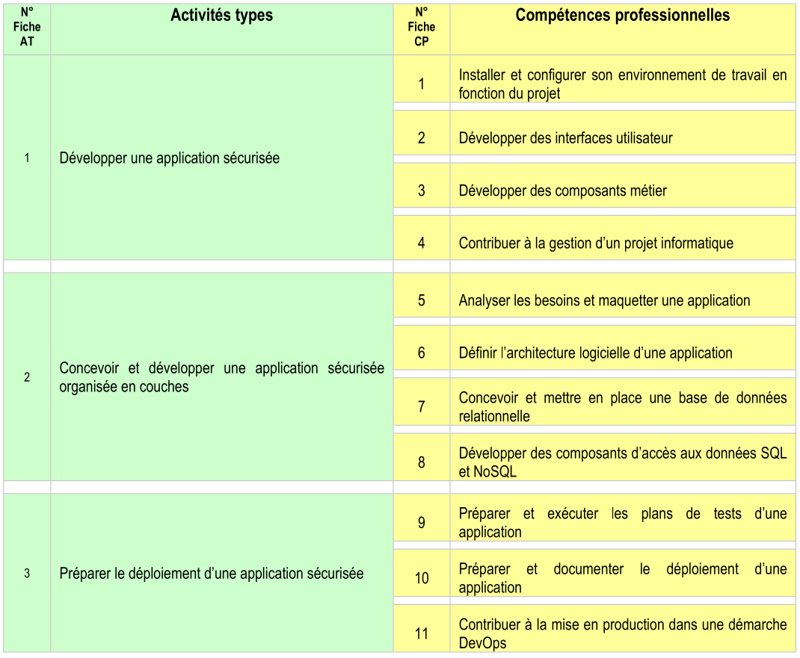

# Compétences couvertes
Les compétences couvertes sont les suivantes:

- 1 Développer une application sécurisée
    - 1 Installer et configurer son environnement de travail en fonction du projet
    - 2 Développer des interfaces utilisateur
    - 3 Développer des composants métier
    - 4 Contribuer à la gestion d'un projet informatique

- 2 Concevoir et développer une application sécurisée organisée en couches
    - 5 Analyser les besoins et maquetter une application
    - 6 Définir l’architecture logicielle d’une application
    - 7 Concevoir et mettre en place une base de données relationnelle
    - 8 Développer des composants d’accès aux données SQL et NoSQL

- 3 Préparer le déploiement d’une application sécurisée
    - 9 Préparer et exécuter les plans de tests d’une application
    - 10 Préparer et documenter le déploiement d'une application
    - 11 Contribuer à la mise en production dans une démarche DevOps

Le projet de bot Discord couvre les compétences suivantes:

Tandis que le second projet couvre les compétences suivantes: